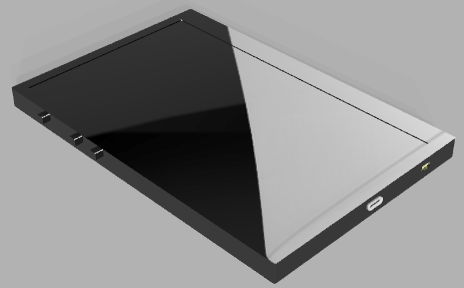
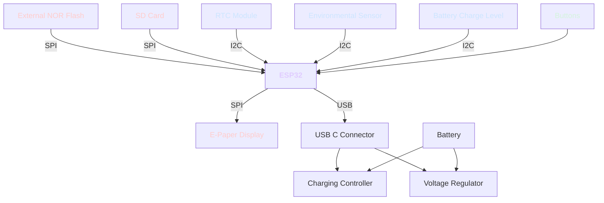

# 📚🌟 OpenBook 🌟📚
#### Birladeanu Raluca-Monica 335CA
> An infinite little library, your very own **pocket-sized story companion**.  Read a thousand books, live a thousand lives with OpenBook!~ 🌸

## Block Diagram

## Bill of Materials
|Component|Description|Purchase|Datasheet|
|---------|-----------|--------|---------|
|EAGLE-LTSPICE_CC0402 | Capacitor | https://eu.mouser.com/ProductDetail/KEMET/C0402C475K8PACTU?qs=ulEaXIWI0c9ebKRT3r3htg%3D%3D | https://eu.mouser.com/datasheet/2/447/KEM_C1006_X5R_SMD-3316465.pdf
|ESP32_WROVER_EAGLE-LTSPICE_RR0402 | Resistor | https://eu.mouser.com/ProductDetail/Vishay-Beyschlag/MCS04020D9101BE000?qs=sGAEpiMZZMvdGkrng054twKDKoBh%252BscnK%2FuqkNk9X%252BqO%2Fz5%2F0u93Ow%3D%3D  | https://www.vishay.com/docs/28700/mcx0x0xpre.pdf
|RCL_CPOL-EUCT3528 | Capacitor | https://eu.mouser.com/ProductDetail/Nichicon/LGN2W101MELA25?qs=Fe64Qgzkstf1zMszMsgRoA%3D%3D | https://eu.mouser.com/datasheet/2/293/e_lgn-3082370.pdf
|ADAFRUIT_LEDCHIP-LED0603 | LED | https://eu.mouser.com/ProductDetail/ams-OSRAM/KG-EELP41.22-PHRH-35-A8J8-20-R18?qs=ZcfC38r4Posajg8ZvCDQkg%3D%3D | https://eu.mouser.com/datasheet/2/588/KG_EELP41_22_EN-3572852.pdf
|CPH3225A | Capacitor | https://eu.mouser.com/ProductDetail/Seiko-Semiconductors/CPH3225A?qs=3etwrb1wR%252BhUOph6lAO7eg%3D%3D | https://eu.mouser.com/datasheet/2/360/Seiko_Instruments_MicroBattery_E_20230330_2024Jan_-3561061.pdf
|ESP32_WROVER_SPARKFUN-DISCRETESEMI_MOSFET_PCH-DMG2305UX-7 | Transistor | https://eu.mouser.com/ProductDetail/Diodes-Incorporated/DMG2305UX-7?qs=L1DZKBg7t5F%2FNBHrjfxC%252Bg%3D%3D | https://www.diodes.com/assets/Datasheets/DMG2305UX.pdf
|ESP32_WROVER_AVX---SD0805S020S1R0_AVX_SD0805S020S1R0_0_0AVX_SD0805S020S1R0_0_0 | Diode | https://eu.mouser.com/ProductDetail/ROHM-Semiconductor/SCS310AMC7G?qs=iLKYxzqNS75xiccEgNnX2g%3D%3D | https://fscdn.rohm.com/en/products/databook/datasheet/discrete/sic/sbd/scs310am-e.pdf
|SI1308EDL-T1-GE3 | Transistor | https://eu.mouser.com/ProductDetail/Vishay-Semiconductors/SI1308EDL-T1-GE3?qs=bX1%252BNvsK%2FBramh9tgpOaEw%3D%3D | https://www.vishay.com/docs/63399/si1308edl.pdf
|ESP32C6_VARISTORCN1812 | Varistor | https://eu.mouser.com/ProductDetail/Schurter/PFMF.050.2?qs=1auRipcfynCums5v1iucSA%3D%3D | https://eu.mouser.com/datasheet/2/358/typ_PFMF-1275918.pdf
|ESP32_WROVER_BME680_BME680 | Integrated Environmental Unit | https://eu.mouser.com/ProductDetail/M5Stack/U001-C?qs=e8oIoAS2J1R2mB7ZY1%252BSZg%3D%3D | https://docs.m5stack.com/en/unit/envIII
|ESP32-C6-WROOM-1-N8 | MicroController | https://eu.mouser.com/ProductDetail/Espressif-Systems/ESP32-C6?qs=Imq1NPwxi75noDtUpuVuWw%3D%3D | https://eu.mouser.com/datasheet/2/891/esp32_c6_datasheet_en-3304070.pdf
| 744043680IND_4828-WE-TPC_WRE | Inductor | https://eu.mouser.com/ProductDetail/Wurth-Elektronik/744043680?qs=PGXP4M47uW6VkZq%252BkzjrHA%3D%3D | https://www.we-online.com/components/products/datasheet/744043680.pdf
|SI1308EDL-T1-GE3 | Transistor | https://eu.mouser.com/ProductDetail/Vishay-Semiconductors/SI1308EDL-T1-GE3?qs=bX1%252BNvsK%2FBramh9tgpOaEw%3D%3D | https://www.vishay.com/docs/63399/si1308edl.pdf
| BD5229G-TR | Voltage Detector | https://eu.mouser.com/ProductDetail/ROHM-Semiconductor/BD5229G-TR?qs=sGAEpiMZZMutXGli8Ay4kAMqIQqqdOUlDFcDfPDPIK4%3D | https://fscdn.rohm.com/en/products/databook/datasheet/ic/power/voltage_detector/bd52xxg-e.pdf
|DS3231SN# | RTC Module | https://eu.mouser.com/ProductDetail/Analog-Devices-Maxim-Integrated/DS3231SN?qs=1eQvB6Dk1vhUlr8%2FOrV0Fw%3D%3D | https://eu.mouser.com/datasheet/2/609/DS3231-3421123.pdf
|USBLC6-2SC6Y | ESD Protection | https://eu.mouser.com/ProductDetail/STMicroelectronics/USBLC6-2SC6Y?qs=gNDSiZmRJS%2FOgDexvXkdow%3D%3D | https://eu.mouser.com/datasheet/2/389/usblc6_2sc6y-1852505.pdf
|W25Q512JVEIQ | Flash Memory | https://eu.mouser.com/ProductDetail/Winbond/W25Q512JVEIQ?qs=l7cgNqFNU1jw6svr3at6tA%3D%3D | https://eu.mouser.com/datasheet/2/949/Winbond_W25Q512JV_Datasheet-3240039.pdf
|SAMACSYS_PARTS_USB4110-GF-A | USB Connector | https://eu.mouser.com/ProductDetail/GCT/USB4110-GF-A?qs=KUoIvG%2F9IlYiZvIXQjyJeA%3D%3D | https://eu.mouser.com/datasheet/2/837/GCT_USB4110_Product_Drawing___20k_cycles-3455479.pdf
|FH34SRJ | E-Paper Display Header | https://eu.mouser.com/ProductDetail/Hirose-Connector/FH34SRJ-7S-0.5SH50?qs=vcbW%252B4%252BSTIqHa4IamMh36g%3D%3D | https://eu.mouser.com/datasheet/2/185/FH34SRJ_7S_0_5SH_50__CL0580_1200_0_50_2DDrawing_00-1615127.pdf
|MAX17048G+T10 | Battery Management | https://eu.mouser.com/ProductDetail/Analog-Devices-Maxim-Integrated/MAX17048G%2bT10?qs=D7PJwyCwLAoGnnn8jEPRBQ%3D%3D | https://eu.mouser.com/datasheet/2/609/MAX17048_MAX17049-3469099.pdf
|MCP73831 | Battery Controller | https://eu.mouser.com/ProductDetail/Microchip-Technology/MCP73831T-2ATI-MC?qs=yUQqVecv4qs9k7ug0bEXiw%3D%3D | https://eu.mouser.com/datasheet/2/268/MCP73831_Family_Data_Sheet_DS20001984H-3441711.pdf
|112A-TAAR-R03_ATTEND | SD Card Mount | https://store.comet.srl.ro/Catalogue/Product/43497/ | https://store.comet.srl.ro/Catalogue/Product/43497/
|XC6220A331MR-G | LDO Voltage Regulator | https://eu.mouser.com/ProductDetail/Torex-Semiconductor/XC6220A331MR-G?qs=AsjdqWjXhJ8ZSWznL1J0gg%3D%3D | https://eu.mouser.com/datasheet/2/760/xc6220-3371556.pdf

## Hardware components
- ESP32-C6-WROOM-1-N8 Microcontroller

### Communication interfaces

| Communication interface | Connected Components |
|--------------|----------------------|
| I2C        | RTC, BME688, Battery Level     |
| SPI        | SD Card, E-Paper Display, NOR Flash     |
| USB        | USB C Connector / Power     |

### ESP32-C6-WROOM-1-N8 Pin Mapping

| ESP32 Pin | Signal | Purpose |
|--------------|----------------------|---------|
| IO0        | INT_RTC     | RTC communication |
| IO1        | 32KHZ     | RTC communication |
| IO2        | MISO     | SD Card, NOR Flash |
| IO3        | EPD_BUSY     | EPD status |
| IO4        | SS_SD | SD Card |
| IO5        | EPD_DC | EPD Data/Command |
| IO6        | SCK  | BME688, SD Card, NOR Flash |
| IO7        | MOSI   | SD Card, NOR Flash, EPD |
| IO8        | GPIO8 | SD card select |
| IO9        | IO/BOOT   | Boot button |
| IO10       | EPD_CS   | EPD chip select|
| IO11       | FLASH_CS    | NOR Flash chip select |
| IO12       | USB_D-| USB communication |
| IO13       | USB_D+        | USB communication |
| IO15       | IO/CHANGE   | Button change |
| IO16       | TX   | Transmit |
| IO17       | RX   | Receive |
| IO18       | RTC_RST   | RTC reset |
| IO19       | I2C_PW   | BME688 power management |
| IO20       | EPD_3V3_C   | EPD |
| IO21       | SDA   | RTC, BME688, Battery Level (I2C data) |
| IO22       | SCL   | RTC, BME688, Battery Level (I2C clock) |
| IO23       | EPD_RST   | EPD reset |

- Real-Time Clock Module (RTC)
  - A DS3231SN RTC module
  - It communicates through I2C with the microcontroller
  - Pin connections:
      - SCL -> IO22
      - SDA -> IO21
      - RTC_RST -> IO18
      - 32KHZ -> IO1
      - INT_RTC -> IO0
- SD Card
  - It communicates through SPI
  - Pin connections:
    - MISO - IO2
    - SCK - IO6
    - MOSI - IO7
    - SS_SD - IO4
- E-Paper Display (EPD)
  - It communicates through SPI
  - Pin connections:
    - EPD_CS -> IO10
    - EPD_DC -> IO5
    - EPD_RST -> IO23
    - EPD_BUSY -> IO3
    - MOSI, SCK -> shared with SD
- Environmental Sensor
  - BME688 sensor
  - It communicates through I2C
  - Pin connections:
      - SCL -> IO22
      - SDA -> IO21
- Li-Po Battery Charging Controller
  - Battery Charge Level
    - It communicates through I2C
    - Pin connections:
        - SCL -> IO22
        - SDA -> IO21
- LDO Voltage Regulator
  - Lowers the 5V to 3.3V for the microcontroller and the attached modules
- SPI ESD Protection Lines
- NOR Flash 64MB
  - It communicates through SPI
  - Pin connections:
    - FLASH_CS -> IO11
    - SCK, MOSI, MISO
- USB
  - USB_D- -> IO12
  - USB_D+ -> IO13
- Buttons for user input
  - RESET -> EN
  - IO/BOOT -> IO9
  - IO/CHANGE -> IO15
- Qwiic / Stemma QT Connector
  - It communicates through I2C
  - SCL, SDA

